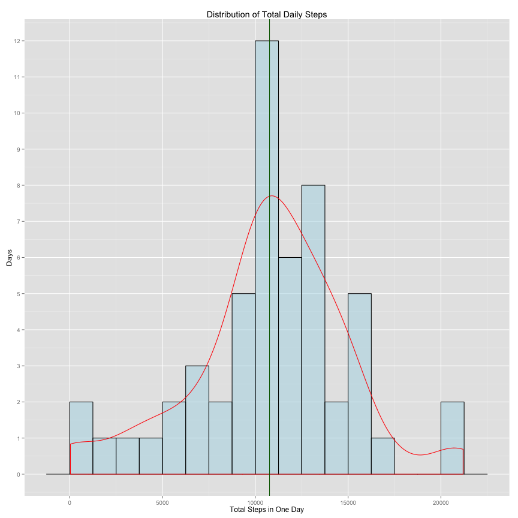
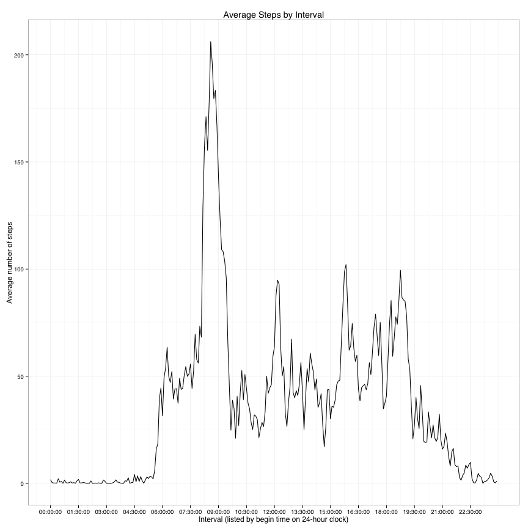

  
# Reproducible Research: Peer Assessment 1  
### by John Barnes  
*submitted on 20 Sept 2015 in Reproducible Research course repdata-032*  
  
## Introduction/Housekeeping  
  
The data to be examined are step counts at five minute intervals for a single individual during the
months of October and November 2012. Questions to be investigated were set by the class assignment and
are answered below in the order of the class assignment.  
Prior to beginning analysis, some library packages that will be used needed to be loaded.  
Two functions that are useful throughout the process are also created: NaRmMean and NaRmMedian.
These are simply the mean and median functions with the default reset so that NAs are ignored,
which will be useful for Questions 1 and 2.  

```r
      ##Library Calls
suppressPackageStartupMessages(library(data.table))
suppressPackageStartupMessages(library(ggplot2))
suppressPackageStartupMessages(library(plyr))
suppressPackageStartupMessages(library(dplyr))
suppressPackageStartupMessages(library(magrittr))
suppressPackageStartupMessages(library(chron))
      ## Establish functions NaRmMean and NaRmMedian
NaRmMean<-function(x){mean(x,na.rm=TRUE)}
NaRmMedian<-function(x){median(x,na.rm=TRUE)}
```
  
## Loading and preprocessing the data  
  
Data were located in the file https://d396qusza40orc.cloudfront.net/repdata%2Fdata%2Factivity.zip and were 
downloaded into a dataset called ActivityData. Preliminary inspection 
revealed that missing data for steps were confined to eight days that were 
missing completely.  
  
### data loading and preliminary inspection
  

```r
      ##Acquire data
ActivityZipped<-tempfile()
download.file("https://d396qusza40orc.cloudfront.net/repdata%2Fdata%2Factivity.zip",ActivityZipped,"curl")
      ##Read data into dataset
ActivityData<-data.table()
ActivityData<-read.csv(unz(ActivityZipped,"activity.csv"))
      ##First inspection
summary(ActivityData)
```

```
##      steps                date          interval     
##  Min.   :  0.00   2012-10-01:  288   Min.   :   0.0  
##  1st Qu.:  0.00   2012-10-02:  288   1st Qu.: 588.8  
##  Median :  0.00   2012-10-03:  288   Median :1177.5  
##  Mean   : 37.38   2012-10-04:  288   Mean   :1177.5  
##  3rd Qu.: 12.00   2012-10-05:  288   3rd Qu.:1766.2  
##  Max.   :806.00   2012-10-06:  288   Max.   :2355.0  
##  NA's   :2304     (Other)   :15840
```

```r
PercentStepsMissing<-100*2304/17568
```
  
The first summary of ActivityData showed that a value for "steps" was missing
in 13.1% of the data, a proportion
more than large enough to affect the results of analysis if it were all concentrated in one area.
Therefore a quick summary of the missing data cases was prepared to see whether missing values for 
steps were concentrated in a few areas or scattered throughout the data set.
  
### examination of distribution of missing data
  

```r
ActivityDataNAs<-data.table()
ActivityDataNAs<-ActivityData[is.na(ActivityData$steps),]
WhichDatesMissingSteps<-as.Date(unique(ActivityDataNAs$date))
NumberDatesMissingSteps<-length(WhichDatesMissingSteps)
WhichDaysMissingSteps<-weekdays(WhichDatesMissingSteps)
```
Pulling out the rows where the steps value was missing revealed that the record was actually missing 
all data for 8 complete days. Those dates were 2012-10-01, 2012-10-08, 2012-11-01, 2012-11-04, 2012-11-09, 2012-11-10, 2012-11-14, 2012-11-30, 
which fall on the weekdays Monday, Monday, Thursday, Sunday, Friday, Saturday, Wednesday, Friday.
This information provided some assurance that since missing data were distributed evenly across 
intervals and rough proportionately between weekdays and weekends, the answers for Questions 1 and 2 
 would not be severely affected. It also provided a good starting point for Questions 3 and 4.  
  
## Question 1. What is mean total number of steps taken per day?
  
This question required creating a derived dataset of daily step 
counts (TotalStepsBy Date), calculating the mean and median daily 
step counts, and preparing a histogram of daily step counts.
  
### initial grouping and summing of steps by date, exported to dataset TotalStepsByDate
  

```r
Steps_By_Date<-data.table()
Steps_By_Date<-ActivityData %>% group_by(date)
TotalStepsByDate<-Steps_By_Date%>%summarise_each(funs(sum),steps)
```
  
### calculate requested statistics 
  

```r
#uses functions defined above to ignore NAs
MeanTotalDailySteps<-NaRmMean(TotalStepsByDate$steps) 
MedianTotalDailySteps<-NaRmMedian(TotalStepsByDate$steps)
```
The mean total daily steps, ignoring NAs, was found to 
be 10766, quite close to the median total daily 
steps of 10765. Closeness of mean and median 
suggests a normal or binomial distribution. 
  
### histogram of daily total steps 
  

```r
TotalStepsPlot<-ggplot(TotalStepsByDate) #setting up the histogram
TotalStepsPlot<-TotalStepsPlot + aes(TotalStepsByDate$steps)
TotalStepsPlot<-TotalStepsPlot + geom_histogram(binwidth=1250, 
                                                fill="lightblue",
                                                colour="black") 
      #binwidth chosen to have about 20 bins, 8 bins=10,000, 
      #about 3 cases/bin for a uniform distribution
TotalStepsPlot<-TotalStepsPlot + scale_y_continuous(breaks=0:15)
TotalStepsPlot<-TotalStepsPlot + labs(title="Distribution of Total Daily Steps")
TotalStepsPlot<-TotalStepsPlot + labs(x="Total Steps in One Day")
TotalStepsPlot<-TotalStepsPlot + labs(y="Days")
TotalStepsPlot<-TotalStepsPlot + theme_bw(base_family = 'Helvetica')
TotalStepsPlot
```

 
  
Given that for this plot, each day is a case, and there are 
therefore only 61 cases, the plot looks to be in good accord with
a normal or binomial distribution; that hypothesis might warrant 
further investigation. 
  
## Question 2. What is the average daily activity pattern?  
  
### initial grouping and finding means of steps by interval, exported to AverageIntervalSteps  
  

```r
Steps_By_Interval<-data.table()
Steps_By_Interval<-ActivityData %>% group_by(interval)
AverageIntervalSteps<-Steps_By_Interval%>%summarise_each(funs(NaRmMean),steps)
```
  
### convert intervals to class 'times' so that x axis will scale properly
  

```r
AverageIntervalSteps$hour<-as.integer(AverageIntervalSteps$interval/100) #extract hour
AverageIntervalSteps$minutes<-AverageIntervalSteps$interval-100*AverageIntervalSteps$hour #extract minutes
AverageIntervalSteps$CharacterHour<-as.character(AverageIntervalSteps$hour) #convert hour to character
AverageIntervalSteps$CharacterMinutes<-as.character(AverageIntervalSteps$minutes) #convert minutes to character
Leader<-"0" #to be applied for low values in creating consistent character times
Trailer<-"00" #attach to times to create seconds
#attach Leader to CharacterHour and CharacterMinute for values <10
for (j in 1:nrow(AverageIntervalSteps)) {
      if (AverageIntervalSteps$hour[j]<10) { 
            AverageIntervalSteps$CharacterHour[j]<-paste(Leader,AverageIntervalSteps$CharacterHour[j],sep="")
      }
      if (AverageIntervalSteps$minutes[j]<10) { #attach Leader to CharacterMinutes for values <10
            AverageIntervalSteps$CharacterMinutes[j]<-paste(Leader,AverageIntervalSteps$CharacterMinutes[j],sep="")
      }
}
#assemble character-class interval
AverageIntervalSteps$CharacterInterval<-as.character(paste(AverageIntervalSteps$CharacterHour,AverageIntervalSteps$CharacterMinutes,Trailer, sep=":"))
AverageIntervalSteps$interval<-times(AverageIntervalSteps$CharacterInterval) #convert interval to class "times"
AverageIntervalSteps<-AverageIntervalSteps[,1:2] #discard working variables
```
  
### calculate the maximum average interval steps  
  

```r
MaxAverageIntervalSteps <- max(AverageIntervalSteps$steps)
```
  
The maximum number of average interval steps was 206.2.  
  
### lineplot time series interval v. average steps  
  

```r
## Xbreaks, which are specifications for x axis, all need to be in class times
begin<-times("00:00:00")
end<-times("23:55:00")
increment<-times("01:30:00")
Xbreaks<-seq(from=begin,to=end,by=increment)
#draw plot
AverageIntervalStepsPlot<-ggplot(AverageIntervalSteps) #setting up the line plot
AverageIntervalStepsPlot<-AverageIntervalStepsPlot + aes(interval,steps)
AverageIntervalStepsPlot<-AverageIntervalStepsPlot + geom_line() #line plot
AverageIntervalStepsPlot<-AverageIntervalStepsPlot + scale_x_continuous(breaks=Xbreaks)
AverageIntervalStepsPlot<-AverageIntervalStepsPlot + labs(title="Average Steps by Interval")
AverageIntervalStepsPlot<-AverageIntervalStepsPlot + labs(x="Interval (listed by begin time on 24-hour clock)")
AverageIntervalStepsPlot<-AverageIntervalStepsPlot + labs(y="Average number of steps")
AverageIntervalStepsPlot<-AverageIntervalStepsPlot + theme_bw(base_family = 'Helvetica')
AverageIntervalStepsPlot
```

 
  
**Observable features here include: **  
1. the subject is nearly stationary between midnight and about 5:30.  
2. a long brisk run or walk from about 8:30 to 9:30 in the morning (perhaps an exercise routine?)  
3. for most of business hours the steps average between 50 and 125, suggesting a sedentary worker at a desk  
4. activity falls off sharply after about 7:30, suggesting the subject has gone home and finished housework.  
These are all things we might expect of an office worker living in Europe, North America, or other
economically developed areas.
  
## Question 3: Imputing missing values (and recalculating total steps mean, median, and histogram)  
  
Taking advantage of the earlier inspection of the data: steps data are the only data missing, and they
are missing from exactly eight days; on each of those days, all 288 of the 5 minute intervals are missing. 
Furthermore, the dataset begins with midnight of October 1 and ends at 23:55 of Nov 30 with no skipped days.  
  
Thus, we can take the average-per-interval vector from question 2, which runs from 00:00 to 23:55, and add it 
only to the days where NAs occur. Since R automatically repeats the recurring vector in a multiplication, 
multiplying the averages times a logical vector which is TRUE only where there is an NA will result in a 
corrections vector that has a numeric value of the interval average wherever there is an NA, and zero otherwise.
After changing NAs to zeros and adding, the new interpolated values for $steps will be complete. I chose to round
the averages because it gets rid of the absurdity of fractional steps in the data, reduces the very-low-step 
intervals down to a step value of 0, and has very little effect on higher values.  
  
### interpolate values into rows with missing data for steps
  

```r
MissingStepsSelector<-is.na(ActivityData$steps)
InsertIntervalAverages<-MissingStepsSelector*round(AverageIntervalSteps$steps)
ActivityData$steps[is.na(ActivityData$steps)]<-0
ActivityData$steps<-ActivityData$steps+InsertIntervalAverages
```
  
### re-run same procedure as in Question 1 to generate new results for comparison
  

```r
##initial grouping and summing of steps by date, exported to TotalStepsByDate
Steps_By_Date<-data.table()
Steps_By_Date<-ActivityData %>% group_by(date)
TotalStepsByDate<-Steps_By_Date%>%summarise_each(funs(sum),steps)

#calculate the requested statistics
InterpolatedMean<-NaRmMean(TotalStepsByDate$steps)
InterpolatedMedian<-NaRmMedian(TotalStepsByDate$steps)
```
  
### comparison of statistical results with Question 1 results 
  
The mean total steps per day with interpolated values is 10766, 
compared to the original uninterpolated value of 10766.  
The median total steps per day with interpolated values is 10762, 
compared to the original uninterpolated value of  10765.  The 
difference between them is insignificant.
  
### plot of the interpolated data -- new histogram of daily total steps 
  

```r
InterpolatedTotalStepsPlot<-ggplot(TotalStepsByDate) #setting up the histogram
InterpolatedTotalStepsPlot<-InterpolatedTotalStepsPlot + aes(TotalStepsByDate$steps)
InterpolatedTotalStepsPlot<-InterpolatedTotalStepsPlot + geom_histogram(binwidth=1250, 
                                                       fill="lightblue",
                                                       colour="black") 
      #binwidth chosen to have about 20 bins, 8 bins=10,000, 
      #about 3 cases/bin for a uniform distribution
InterpolatedTotalStepsPlot<-InterpolatedTotalStepsPlot + scale_y_continuous(breaks=0:22)
InterpolatedTotalStepsPlot<-InterpolatedTotalStepsPlot + labs(title="Distribution of Total Daily Steps with Interpolated Data")
InterpolatedTotalStepsPlot<-InterpolatedTotalStepsPlot + labs(x="Total Steps in One Day")
InterpolatedTotalStepsPlot<-InterpolatedTotalStepsPlot + labs(y="Days")
InterpolatedTotalStepsPlot<-InterpolatedTotalStepsPlot + theme_bw(base_family = 'Helvetica')
InterpolatedTotalStepsPlot
```

 
  
### comparison of the two histograms  
  
The most obvious thing that leaps out is that the kurtosis (spikiness) of the distribution has 
become much more acute, and the symmetry much clearer,
with the addition of the interpolated values. The histogram still looks roughly like it might be a normal or a 
binomial distribution, but the peak is proportionately higher. 
  
Yet the mean and median are almost the same; the overall center didn't change much, but the distribution changed 
fairly drastically.
  
The most likely cause of this is simply that because missing values were concentrated in 8 days, and the average 
for each interval was used, each of those 8 days received the same interpolated values, leading to the same sum, 
and all of them were added to the central column.  Inspection shows, in fact, that in the original histogram, 
there were 12 values in the central column range, corresponding to the range 10,000-11,250, and in the new graph 
there are 20, with no other column of the histogram changed. To further verify this, I checked the sum of the 
interval averages:

```r
MissingDataIntervalAverageSum<-sum(AverageIntervalSteps$steps)
```
The result was 10766, 
which of course is between 10,000 and 11,250. 
So the actual effect of this method of interpolation was merely to exaggerate the central tendency in the data.

## Question 4: Are there differences in activity patterns between weekdays and weekends?
  
The first task here is to modify the ActivityData dataset so that it includes numeric values for $steps, date 
values for $date, time values for $interval, and a new variable called DayType that has a value of "Weekday" or 
"Weekend." Since the class=time values for $interval), have already been worked out, and as in Question 3 above 
we can take advantage of R's ability to repeat, this is going to be a very quick operation. The auxiliary 
variables DayOWk IsWeekend will be created and then erased in the process.  
  
### Housekeeping: formatting the variables in ActivityData, creating the new DayType variable, and regrouping  
  

```r
ActivityData$date<-as.Date(ActivityData$date)
ActivityData$interval<-as.character(AverageIntervalSteps$interval)
ActivityData$interval<-times(ActivityData$interval)
ActivityData$DayType<-"Weekday"
ActivityData$DayOWk<-weekdays(ActivityData$date,abbreviate=TRUE)
ActivityData$IsWeekend<-ActivityData$DayOWk=="Sat" | ActivityData$DayOWk=="Sun"
ActivityData$DayType[ActivityData$IsWeekend]<-"Weekend"
ActivityData<-ActivityData[,1:4]
```
The next task is to regroup the dataset on two variables: interval and DayType, so that we can produce
the breakout of two time series to compare.


```r
StepsXIntDayType<-data.table()
StepsXIntDayType<-ActivityData %>% group_by(interval,DayType)
AverageIntervalDayTypeSteps<-StepsXIntDayType%>%summarise_each(funs(NaRmMean),steps)
```
### drawing the requested plots of interval average steps for weekends and weekdays
  

```r
##Xbreaks, which are specifications for x axis, all need to be in class times
begin<-times("00:00:00")
end<-times("23:55:00")
increment<-times("01:30:00")
Xbreaks<-seq(from=begin,to=end,by=increment)
#draw plot
AvgIntDTStpsPlot<-ggplot(AverageIntervalDayTypeSteps) #setting up the line plot
AvgIntDTStpsPlot<-AvgIntDTStpsPlot + aes(interval,steps)
AvgIntDTStpsPlot<-AvgIntDTStpsPlot + geom_line() #line plot
AvgIntDTStpsPlot<-AvgIntDTStpsPlot + scale_x_continuous(breaks=Xbreaks)
AvgIntDTStpsPlot<-AvgIntDTStpsPlot + labs(title="Average Steps by Interval (NAs have been interpolated)")
AvgIntDTStpsPlot<-AvgIntDTStpsPlot + labs(x="Interval (listed by begin time on 24-hour clock)")
AvgIntDTStpsPlot<-AvgIntDTStpsPlot + labs(y="Average number of steps")
AvgIntDTStpsPlot<-AvgIntDTStpsPlot + facet_grid(DayType ~ .)
AvgIntDTStpsPlot<-AvgIntDTStpsPlot + theme_bw(base_family = 'Helvetica')
AvgIntDTStpsPlot
```

 
  
### observations about average steps (interpolated) versus interval and DayType  
  
1. Overall, on weekends, the subject is more active across the whole day.  
2. Subject starts his/her heavy activity somewhat later, after a much less active waking up and getting ready period.  
3. The morning heavy workout period on weekends is only about 3/4s as intense on weekends as it is during the week.  
4. Nevertheless weekends are much more active than weekdays, because on weekends:  
      a. Subject does not become inactive till well after 9 pm (as opposed to 7:30 during week).  
      b. Subject has 2-3 other bursts of activity almost as big as the morning peak during weekend afternoons.  
